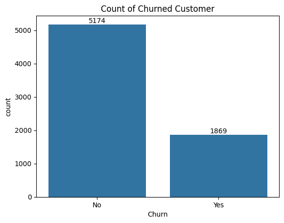
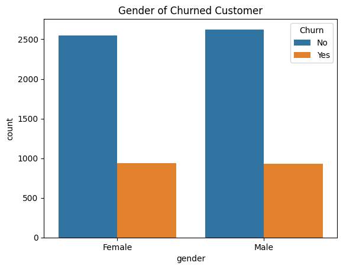
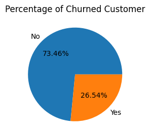

# 📊 Customer Churn Analysis Project  
**Tools Used:** Python, Pandas, NumPy, Seaborn, Matplotlib, Jupyter Notebook  

---

## 📝 **Summary**  
This project analyzes telecom customer churn patterns using **Python** and data visualization tools. By exploring demographic and transactional data, key retention factors are identified, and trends are visualized to help businesses reduce churn rates.  

---

## 🔧 **What I Did**  
- **Data Loading & Cleaning:**  
  - Replaced blank values in `TotalCharges`.  
  - Converted binary `SeniorCitizen` values to "Yes/No" format.  
- **Exploratory Analysis:**  
  - Calculated overall churn rate (**26.54%**).  
  - Analyzed gender distribution patterns.  
- **Visualizations:**  
  - Created count plots and pie charts using **Seaborn/Matplotlib**.  
  - Generated comparative visuals for demographic insights.  

---

## 📚 **What I Learned**  
- Techniques for handling missing data and categorical conversions.  
- Effective use of **count plots** for distribution analysis.  
- Interpretation of **pie charts** for proportional insights.  
- Identifying churn indicators through visual storytelling.  
- Streamlined workflows in **Jupyter Notebook**.  

---

## ✅ **Key Results**  
- **26.54% overall churn rate** identified as a critical business risk.  
- **Gender-neutral churn pattern** (similar rates across genders).  
- Prioritized focus areas for retention strategies:  
  - Service contract types  
  - Tenure duration trends  
  - Relationship between monthly/total charges and churn  

---

## 🌄 **Screenshots**  
 
- **Churn Distribution**:

  
  
- **Gender Analysis**:
  
  
     
- **Churn Percentage**:
  
      

---

## 🌱 **Future Improvements**  
- Analyze impact of **service contract types** on retention.  
- Investigate **tenure duration patterns** for loyalty insights.  
- Explore correlations between charges and churn behavior.  
- Develop a **machine learning model** for churn prediction.  
- Build an interactive dashboard using **Plotly/Dash**.  

--- 
